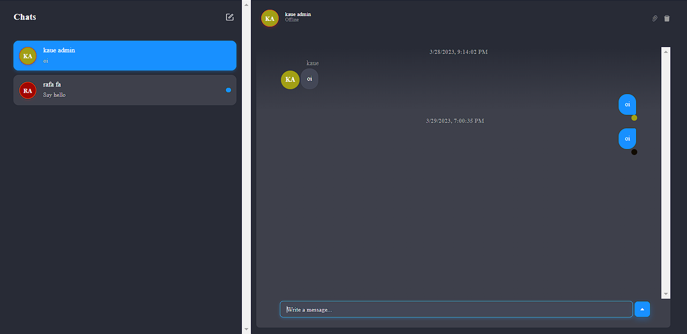

## Chat em React

### Desenvolvimento de um sistema de chat, com integração com a API Chat Engine, dividido por pastas o Back-End do Front-End para melhor entendimento, e também para treinar a estruturação de rotas.

## Para iniciar o servidor

`npm run start`

## Para iniciar o web

`npm run dev`

### Imagem:

